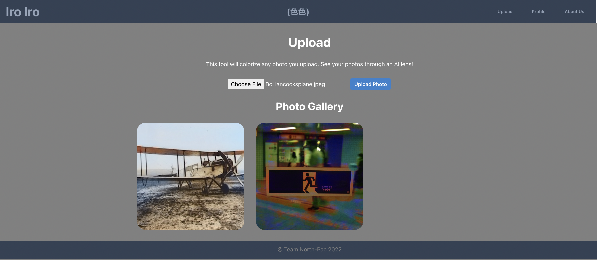
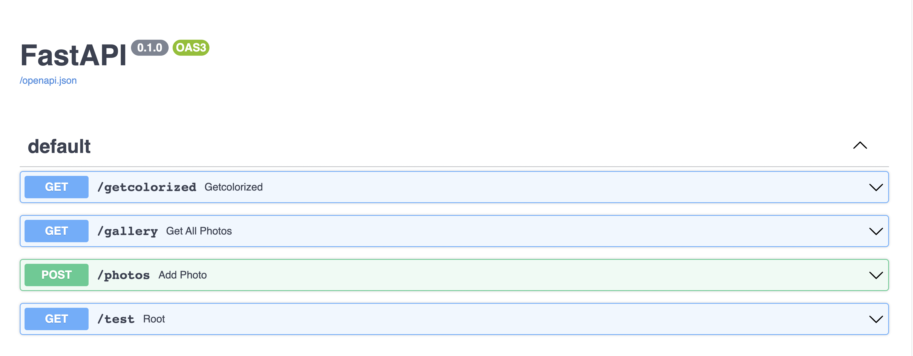

# Iro Iro Colorizer

Created: September 19, 2022 8:26 AM
Github: https://github.com/North-Pac
Tools: Next, Python, React

## Team

- Katrina Hill
- Mat Rangel
- Ben Carter
- Bishal Khanal
- Roger Wells

## Iro Iro

The purpose of this project is to provide an easy way to add color to photos taken in black and white. The project utilizes an open source machine learning model called OpenCV (or Open Computer Vision) to colorize uploaded photographs.

The photos are stored in an AWS S3  bucket. They are uploaded and retrieved via Amazon’s Boto3 tool via Fast API. The front end UI is built in React.

The project was hosted on Heroku, but has recently been taken down. We are considering other hosting options. In the meantime, this project can be used locally.

## How to run locally

In order to run Iro Iro locally, fork the https://github.com/North-Pac/ben-backend-test and https://github.com/North-Pac/hurricane-photo-frontend repositories.

### Frontend

To run the front end React app: in your terminal CD into hurricane-photo-frontend directory and  run the command ‘npm run dev’.

Visit the local page by going to [http://localhost:3000/Upload](http://localhost:3000/Upload) in your browser.

### Backend

To spin up the backend Python app, CD into the ben-backend-test directory and run these commands:

1. `$ pip install -r requirements.txt`
2. `$ uvicorn main:app --reload`

A success message should then be viewable in the terminal as:  Uvicorn running on [http://127.0.0.1:8000](http://127.0.0.1:8000/) (Press CTRL+C to quit)

You can then view the Fast Api Swagger app to view and test the Post and Get functions by visiting http://127.0.0.1:8000/docs

### For AWS S3 implementation

In order to utilize the S3 bucket for storage, you will need to create an AWS account and create an S3 bucket. 

You can then go to the security credentials page to obtain your access key and secret access key. These are necessary in the next step.

Install the AWS CLI by running the following commands:

`$ curl "[https://awscli.amazonaws.com/AWSCLIV2.pkg](https://awscli.amazonaws.com/AWSCLIV2.pkg)" -o "AWSCLIV2.pkg"`
`$ sudo installer -pkg AWSCLIV2.pkg -target /`

Finally, configure the CLI by running:

`$ aws configure`

Here you will enter the S3 bucket name, access key, and secret access key information. 

It is important to add the correct server location found on the S3 bucket page and listed under region. 

Now you can upload photos using the [http://localhost:3000/Upload](http://localhost:3000/Upload) page, and view a gallery of your uploaded photos. This project will be hosted at a later time, so these steps will not be necessary. But, by running locally, you can upload and colorize photos to your own AWS account.

Enjoy!
